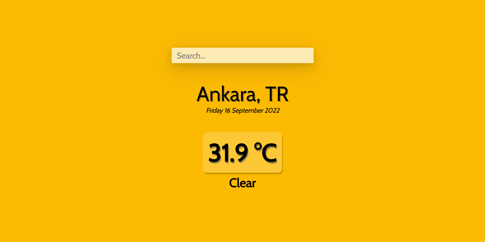

# Weather App

Live website : https://fatihbulbul1.github.io/react-weather-app/
# Overview
Made by:
- **React**
- **React hooks**
- Openweather API
- HTML
- CSS
- JS

### Fonts
```css
 font-family: 'Cabin', sans-serif;
```
```css
<style>
@import url('https://fonts.googleapis.com/css2?family=Cabin&display=swap');
</style>
```
### Background
``` css
    background-color: #609bca; /* default */

    background-color: #fcba03; /* hot */

    background-color: #ffff00; /* warm */

    background-color: #00b7ff; /* mild */

    background-color: #0055ff; /* cold */

```
## Description 
- Weather tracking app written by React. You can search for cities and countries.
- Responsive background color depending on weather temperature.
- API provided by https://openweathermap.org/ .

### Author
- LinkedIn - [Ömer Fatih Bülbül](https://www.linkedin.com/in/ömer-fatih-bülbül-74a890236/)
- Twitter - [fatihbulbul91](https://twitter.com/fatihbulbul91)
